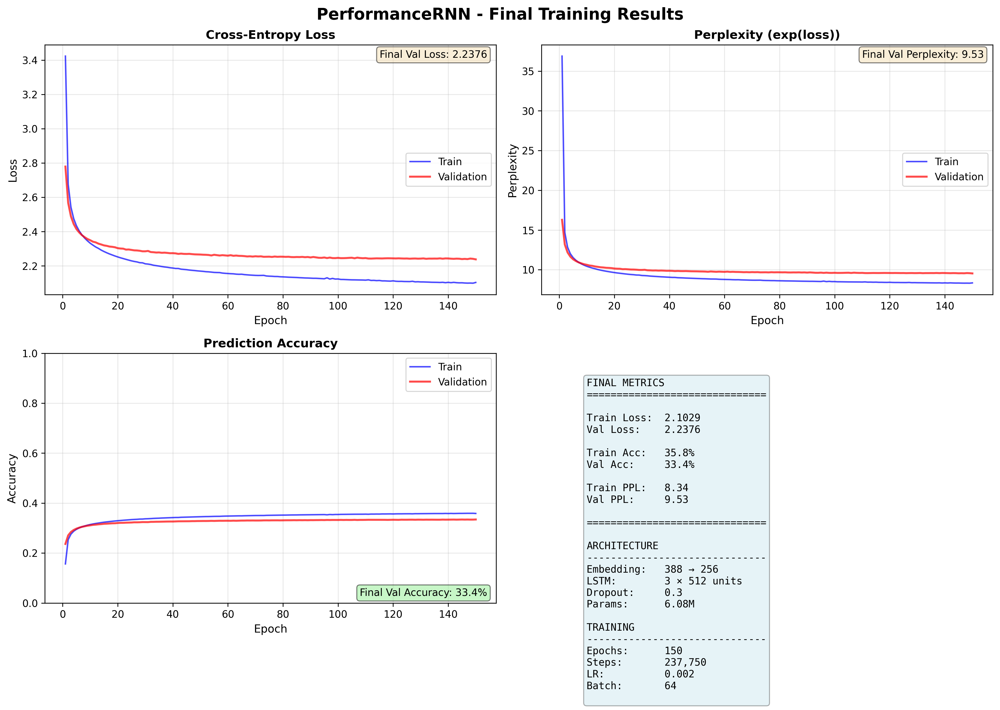
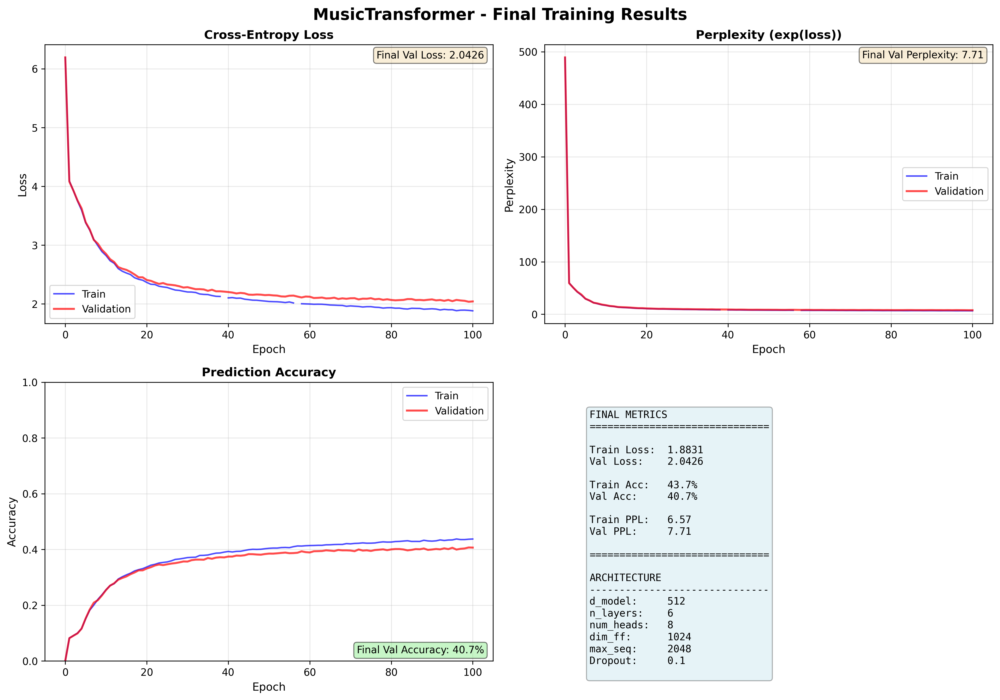

# MusicAI

Proyecto final de Deep Learning sobre generacion de musica de piano con dos enfoques:

- `musiclstm/`: implementacion tipo PerformanceRNN basada en LSTM
- `musictransformer/`: implementacion Music Transformer con Relative Position Representations

Esta version del repositorio esta preparada para GitHub a partir del trabajo final original. Se han conservado el codigo, la memoria, las metricas y ejemplos ligeros, dejando fuera datasets, checkpoints y pesos pesados para que el repo sea util y navegable.

## Documentacion

- Memoria final: [docs/report/trabajo_final_deep_learning.pdf](docs/report/trabajo_final_deep_learning.pdf)
- Fuente LaTeX: [docs/report/trabajo.tex](docs/report/trabajo.tex)
- Propuesta inicial: [docs/report/propuesta-trabajo-music.pdf](docs/report/propuesta-trabajo-music.pdf)
- Resumen comparativo: [COMPARISON_SUMMARY.md](COMPARISON_SUMMARY.md)

## Resultados

| Metrica | LSTM | Transformer |
| --- | --- | --- |
| Val Loss | 2.2376 | 2.0426 |
| Val Accuracy | 33.43% | 40.67% |
| Val Perplexity | 9.53 | 7.71 |
| Parametros | 6.08M | ~25M |
| Tiempo de entrenamiento | 10h | 5h |

El Transformer fue el mejor modelo en calidad final, mientras que la LSTM resulto mas ligera y sencilla de entrenar y depurar.

## Estructura

```text
musicai/
├── docs/report/                  # Memoria, propuesta y figuras del trabajo
├── COMPARISON_SUMMARY.md         # Resumen directo de la comparativa
├── musiclstm/                    # Implementacion LSTM
│   ├── performance_net/          # Codigo del modelo
│   ├── examples/                 # MIDIs y un WAV de ejemplo
│   └── final_training_metrics.png
└── musictransformer/             # Implementacion Transformer
    ├── model/                    # Arquitectura
    ├── dataset/                  # Codigo de dataset
    ├── utilities/                # Utilidades de entrenamiento
    ├── examples/                 # MIDIs y un WAV de ejemplo
    └── saved_models/results/     # CSV y mejores epochs
```

## Lo que no se incluye

El entregable original superaba 1.3 GB e incluia:

- dataset MAESTRO completo
- checkpoints y pesos entrenados
- logs de TensorBoard
- grandes lotes de audio generado

Esos artefactos no estan versionados aqui para evitar un repositorio pesado y poco practico. Las rutas siguen documentadas en cada subproyecto por si se quiere reconstruir el entorno original.

## Como reproducir

### LSTM

```bash
cd musiclstm
python -m venv .venv
source .venv/bin/activate
pip install -r requirements.txt
python train.py
```

El dataset esperado va en `musiclstm/data/`.

### Transformer

```bash
cd musictransformer
python -m venv .venv
source .venv/bin/activate
pip install -r requirements.txt
python preprocess_midi.py dataset/maestro/maestro-v3.0.0 -output_dir dataset/e_piano
python train.py -input_dir dataset/e_piano -output_dir saved_models --rpr
```

El dataset bruto se espera en `musictransformer/dataset/maestro/` y el dataset procesado en `musictransformer/dataset/e_piano/`.

## Ejemplos y graficas

Cada subcarpeta incluye algunos ejemplos ligeros en `examples/` y la grafica final de entrenamiento:

- [musiclstm/final_training_metrics.png](musiclstm/final_training_metrics.png)
- [musictransformer/final_training_metrics.png](musictransformer/final_training_metrics.png)




